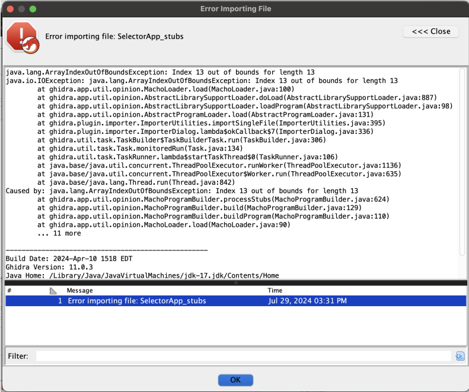
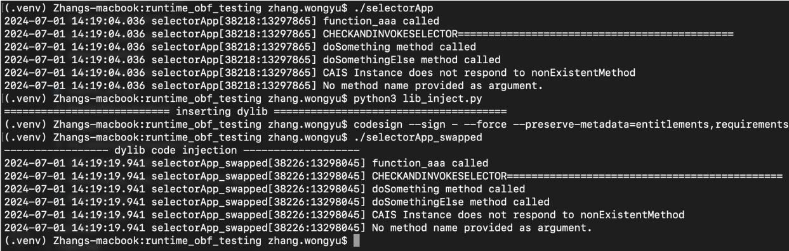

Binary Obfuscation in MachO
===========================

## Purpose
There are many reasons why we would want to obfuscate code! A common purpose of obfuscation is to hinder Reverse Engineering, allowing software developers to prevent malicious attacks on their product or protect intellectual property.

In my case, the main goal is to prevent the evasion of Jailbreak Detection through the use of hooks, or at least make it harder for attackers to find the correct functions to hook.

To do this we will utilize the [LIEF framework](https://lief.re/), a powerful Library for manipulating PE, ELF and `MachO` Binaries.

As we are working directly on the compiled Binary, this is considered file format modification, which is powerful in preventing reverse engineering tools from working correctly.

As stated by Romain Thomas, Author of [The Poor Man's Obfuscator](https://www.romainthomas.fr/publication/22-pst-the-poor-mans-obfuscator/) which was heavily referenced for this project.

> "File format modifications are less resilient than classical obfuscation since the original assembly code remains unchanged. On the other hand, this is a topic that is less explored than regular obfuscation and for which, it exists less tooling, automation, and literature." - Romain Thomas

### What is Code Obfuscation?
Code obfuscation is the act of making code unintelligible and more complex though the use of various techniques such as Source Code, Compile Time or Binary Obfuscation. With the main aim of increasing complexity for Reverse Engineers.

### What is MachO?
Mach-O, short for Mach object file format, is a file format for executables, object code, shared libraries, dynamically loaded code, and core dumps. It was developed to replace the a. out format. It is used on on all of Apple's devices, including MacOS and `iOS`.

For a more detailed layout, we can refer to the [MachO file format reference](https://github.com/aidansteele/osx-abi-macho-file-format-reference). Note that this is an outdated version of Apple's documentation, and there have been changes to the file format.

```jsx
+----------------------+
| Header               | 
+----------------------+
| Load Commands        | 
|  - LC_SEGMENT        |
|  - LC_SYMTAB         | 
|  - LC_LOAD_DYLIB     |
|         ....         | 
+----------------------+
| Segment: __TEXT      | 
| +-----Sections-----+ |
| | __text           | | 
| | __stubs          | | 
| | __const          | |
| |       ....       | |
| +------------------+ |
+----------------------+ 
| Segment: __DATA      | 
| +-----Sections-----+ |
| | __data           | | 
| | __bss            | | 
| |       ....       | |
| +------------------+ |
+----------------------+
| __LINKEDIT           |
| +------------------+ |
| | __symbol_table   | |
| | __string_table   | |
| | __indirect       | |
| |       ....       | |
| | __code_sign      | |
| +------------------+ |
+----------------------+
```

### Things to note when working with MachO
- Binaries are required to be signed before execution, if not they will encounter a `killed: 9` error.
- A valid Apple developer certificate is required to sign and `.IPA` file before we can load it onto a phone with a valid certificate from that same developer.
    > note that you would need to use apple's codesign to resign the binary.

## The tool
To showcase binary obfuscation, I have come up with [Python CLI tool](https://github.com/fieash/ios-obfuscation) based on the [LIEF library](https://lief.re/), to easily apply simple techniques.

To see the options available for the tool, we can run it with the `-h` flag.
```python
python3 simple_obfuscator.py -h
```

### Flags
- `-i` or  `--infile` flag to select the `<input_file>`.
- `-o` or `--outfile` flag to select the `<output_file>`.
- `-r` or `--resign` flag to resign the output file.
- `-s` or `--stubsexpand` flag to shift the stubs by amount specified, set 1 to auto calculate.
- `-d` or `--dylibinsert` flag to select a precompiled dylib that we can link to the binary.
- `-f` or `--removefunctions` flag to remove function table and function list.
- `-g` or `--exportgarbage` flag to enable the adding of garbage function names.
- `-e` or `--exportrandomize` flag to add garbage table, with address randomization.
- `-l` or `--lcfunctionoverlap` flag to create overlaps in LC_FUNCTION_STARTS
- `-k` or `--knownsymbolsinsert` flag to enable inserting of symbols to export table at the wrong addresses.
- `-w` or `--wipeknownsymbolsinsert` flag to copy, wipe, paste known names version.
- `-v` or `--verbose` flag to enable verbose mode.


### stubsexpand
> How does subs expansion work? In order to break certain disassemblers/decompilers (like ghidra) we can modify the virtual addresses of of the `__stubs` and `__text` sections, this can cause Ghidra to hit an out of bounds error when attempting to analyze, rendering it useless unless patched.



### dylibinsert
> Since Objective C binaries load dylibs before the rest of the binary, we are able to insert code here that runs right before the binary is executed, we can expand on this to include a dylib to hinder dynamic analysis.




### removefunctions
> Obfuscates the binary by removing the functions symbol names, they may still be found by the disassembler, but would be listed as `FUN_<start_address>`. Similar to function name stripping during compile time.

### exportgarbage
>  This is done by adding randomly salted hashes of functions names to export table, increasing the amount of garbage that the reverse engineer has to seive through when analysing the binary.


### exportrandomize
> Similar to `exportgarbage` where addresses are additionally randomized, this may cause some functions to become unidentifiable by the disassember, only use either one of exportgarbage or exportrandomize.


### lcfunctionoverlap
> By creating overlaps in `LC_FUNCTION_STARTS`, we are able to case disassemblers to find additional unidentified functions to the binary, this is because programs like Ghidra look around multiple places to decide which functions to analyze, by overlapping the addresses in LC_FUNCTION_STARTS by shifting the addresses around, we can add more "valid" functions into the binary, confusing the reverse engineer.


### knownsymbolsinsert
> This feature can be enhanced by creating customized list of symbol names relevant to the binary to add to the export table.


### wipeknownsymbolsinsert
> Experimental copy, wipe, paste feature.


## Future Work

### Execution-time encryption and decryption
This is a technique also known as on-the-fly decryption, which is commonly used by polymorphic malwares, where they utilize a decryption stub

Decryption Stub: A small piece of code (stub) is left unencrypted, which is responsible for decrypting the main payload. When the malware is executed, the stub runs first, decrypts the encrypted sections, and then transfers control to the now-decrypted malicious code.

#### Learning from Silver Sparrow (Multi Stage)
Silver sparrow implements multi stage payload loading, each part of
the malware is delivered separately, and therefore the loader is able
to download the decrypted binary, and randomize certain values
inside it, such as C2 addresses, alter malware signature acting
dynamically and evading static analysis.

However, some limitations would be that we may encounter a protection by System Integrity Protection, preventing us from using a main binary to load other binaries.

Nonetheless, if MacOS malware can do it, we should be able to as well(?)
Multi stage delivery also means that source code is written in a way that is separated, so this may be a higer level design that we can't modify.


#### Learning from XLoader (Decyrption Stub)
An alternative is to follow XLoader's dynamic decryption technique. XLoader malware uses a decryption function (decryption stub) at the start of certain encrypted buffers, which they try to make look like regular functions, but when called, actually decrypt an important/sensitive function and execute it!

Not quite sure if I understood the [analysis by checkpoint](https://research.checkpoint.com/2021/time-proven-tricks-in-a-new-environment-the-macos-evolution-of-formbook/) properly, but it seems like the decrypted code is not in a separate library, but rather stored as a buffer in the main code itself.

I dont know how exactly this is being done, and am only able to reference checkpoint security's research blog, perhaps we could reverse the [XLoader binary](https://github.com/objective-see/Malware/blob/main/XLoader.zip).


#### Utilizing code stored in an external dylib
Another alternative is runtime decryption of code stored in an external dylib.

Since We can store code or functions that we want to use in an externally linked
dylib, and only decrypt and load them when we want to use them

[StackOverflow: download and execute iOS code dynamically at runtime](https://stackoverflow.com/questions/23187911/download-and-execute-ios-codedynamically-at-runtime)

this technique would be similar to XLoader's technique of dynamically decrypting and using code using the `dlopen()` and `dlsym()` calls to resolve the original function.


#### Runtime self modification with hooks
Passion thought, dont really have a good idea on how this can be done.


#### Lift code and obfuscate IR
Lifting code from Mach-O binaries back into LLVM IR is a multi-step process that involves disassembling the binary’s machine code, reconstructing its logical structure, and expressing that structure in a high-level intermediate representation (IR). The IR can then be modifed with various plugins before being recompiled back into a binary, this can allow us access to stronger Obfuscation techniques not available on binaires.


## References

### Mach-O back to LLVM IR Lifters
https://github.com/avast/retdec
 - ARM64 support
 - LLVM IR can be recompiled

https://github.com/aengelke/rellume
 - ARM64 support, performance focused
 - LLVM IR can be recompiled

https://github.com/lifting-bits/mcsema
 - ARMv8 in development, but repo is archived.
 - Specifically mentions converting back to LLVM IR to perform Obfuscation/hardening etc

https://github.com/Microsoft/llvm-mctoll
- supports x86-64, Arm32, ELF, but no support for OS X


### Information on Mach-O
[Very good and recent (2-3years ago) information on MachO binaries and personal notes on how they work](https://github.com/qyang-nj/llios/tree/main)

[Old apple documentation on MachO](https://github.com/aidansteele/osx-abi-macho-file-format-reference)

[Short overview of Mach-O binaries](https://blog.efiens.com/post/luibo/osx/macho/)


### Polymorphic malware
[Learn from polymorphic malware on how they perform code obfuscation and alter their logic and structure everytime they are run](https://www.sentinelone.com/cybersecurity-101/what-is-polymorphic-malware/)

[silver sparrow, a recent polymorphic malware built for x86 and ARM64 platform](https://redcanary.com/blog/threat-intelligence/clipping-silver-sparrows-wings/)

[MacOS Malware collection, includes silver sparrow, xloader and XAgent samples](https://github.com/objective-see/Malware)

### Other works on code on modifications
[Code injection into the process by modifying the IAT table (PE files)](https://www.ired.team/offensive-security/code-injection-process-injection/import-adress-table-iat-hooking)

[ARMv8 assembly guide](https://mariokartwii.com/armv8/).

[LIEF updates blog, shows examples on code injection of a reverse shell.](https://lief.re/blog/2022-05-08-macho/)

[Ghidra basics](https://byte.how/posts/what-are-you-telling-me-ghidra/)

[Dumping of iOS binary information tool](https://www.romainthomas.fr/post/23-01-icdump/)

[RASP analysis of SingPass (and techniques for defeating it) it notes that SingPass utilizes an unnamed obfuscator](https://www.romainthomas.fr/post/22-08-singpass-rasp-analysis/)

Author of LIEF on [iOS syscall hooking for obfuscation](https://www.romainthomas.fr/post/22-09-ios-obfuscation-syscall-hooking/) 2nd part which talks more about iOS native code obfuscation, analyzes another application that utilizes same obfuscator but configured differently (crashes when runtime tampering detected)


### Currently available obfuscation tools (some of these are quite old)

[IPSW](https://github.com/blacktop/ipsw), contains multiple tools, can be used to dump information from MachO binaries or work with jailbroken iPhones

https://github.com/kam800/MachObfuscator

[O-MVLL a plugin for LLVM](https://github.com/open-obfuscator/o-mvll)
Very powerful tool which is able to do Control Flow Flattening, Mixed Boolean Arithmetic, Opaque constants, Opaque Fields access and Strings encoding. Done during compile time, requies source code

[Wiki for obfuscator-llvm](https://github.com/obfuscator-llvm/obfuscator/wiki)

https://github.com/Polidea/ios-class-guard

[Compile time symbol renaming, requies source code](https://github.com/preemptive/PPiOS-Rename)
https://github.com/pjebs/Obfuscator-iOS

[Github repo that collates links of many Obfuscators for different formats, written in Chinese.](https://github.com/alphaSeclab/obfuscation-stuff?tab=readme-ov-file#c9bdd398b84c5ddfede6e2b1a78492aa)
https://www.romainthomas.fr/publication/22-pst-the-poor-mans-obfuscator/


### Commercial tools
[ixguard iOS obfuscator](https://www.guardsquare.com/ixguard)

[dexprotector with iOS capabilities](https://licelus.com/products/dexprotector)

[promon jigsaw engine, control flow and string obfuscation on binaries](https://promon.co/security-news/ios-obfuscation)

[Bshield iOS binary obfuscator](https://www.bshield.io/en)

[appdome mobile application obfuscation](https://www.appdome.com/solutions-guide/mobile-code-obfuscation/)

