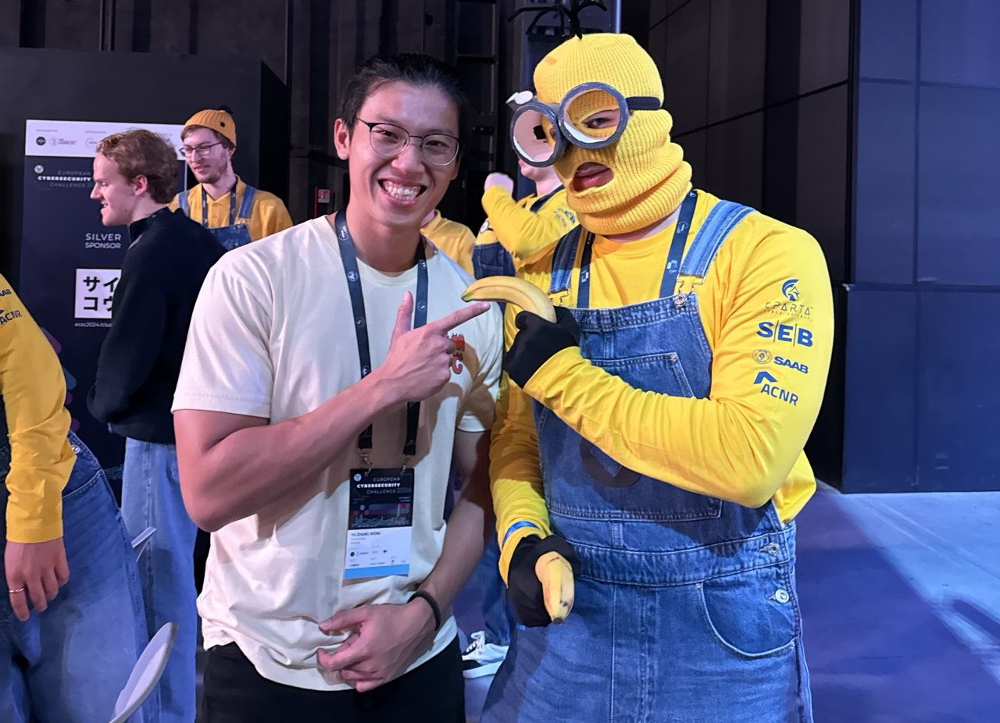

European Cyber Security Challenge 2024
===========================

Earlier this year (October, 2024), I had the amazing opportunity to participate in ECSC2024 representing [NUS Greyhats](https://nusgreyhats.org/team/)! It was an insane experience to participate among some of the best in NUS and was a super cool learning experience for me!

the event was a span of 4 days, consisting of Opening ceremonies, two days of Capture the flag competitions (Jeopardy and Attack Defense) and an afterparty, I had a blast meeting the best European youths here and learning a ton about infosec. We were also sponsored by SoC Takes on the World (STOW), a NUS Computing program giving students the opportunity to represent NUS to compete in overseas competitions!

# Day 0

After a 17 hour flight, we finally arrived in Turin! We had the day to settle down, shake off the jet lag and explore the city that we were going to spend the next week in. It was my first time in Europe and I was amazed by the beautiful architecture and was keen to experience the Italian culture!

# Day 1

Today was the opening ceremony, where we got to test our equipment and credentials, as well as strategize and delegate challenge categories going into the competition tomorrow. We also had the opportunity to meet the other teams, organizers and sponsors of the competition, it was really cool to see the various team introduction videos and learn about the purpose and motivations behind why ECSC was conceived in the first place! (Thank you to the organizers the vibes of the place was AMAZING)

# Day 2

Today was the first day of the Jeopardy style Capture The Flag (CTF), it was an onsite competition where we got to play in the OGR, a old historical building in the middle of Turino city.
This Jeopardy was by far the hardest one I have played so far! It only lasted 8 hours and consisted of [30 challenges, and solutions have been released](https://github.com/ECSC2024/ECSC2024-CTF-Jeopardy). Various teams created cool ways and opportunities to show off! USA in particular brought a button which made an eagle sound which would be pushed whenever a team member solved a challenge, a creative and fun way to create an exciting environment!

After the first day, the team met up to review our results and what we could have done to perform better in the CTF, we also took the time to refine our strategies going into the second day of Attack and Defense.

# Day 3

In the second day of the competition, we would be participating in an Attack Defense (AD) style CTF, teams are provided 8 services, built in by default with vulnerabilities. Teams would have to ensure uptime of the services, meaning that they are able to be used by the organizers legitimately, patch the services such that other teams are able to leak flags and gain points, as well as to develop exploits to steal flags from the other teams!

This was different from other AD CTFs that I had played in before, even featuring an interactive scoreboard showcasing which teams were attacking each other! I loved the stressful atmosphere created by the competitors, which encouraged me to try finding exploits as fast as I could!

# Day 4

It has come to the final day of the event, the prize presentation and closing ceremony, the organizers prepared a multi course dinner, with extremely delicious and unique Italian delicacies, we sat with a sponsor representative from Blu5 Group, Giorgia, who taught us lots about the technologies behind the hardware challenge her company prepared for the Jeopardy CTF! I was so sad that I had to leave after making so many friends and learning a ton about every security field imaginable.

I even manged to trade one of our very own GreyCTF2024 hardware badges with Redou!
Shoutout to my Belgian boys Redou and Kerim! 

# Concluding thoughts

Overall this was an insane eye-opening experience for me! I had the chance to compete and get to know some of the smartest minds in Europe, learning different cultures, techniques and opportunities available around the world in the realm of cyber security. Thank you again to STOW for this priceless opportunity of adventure and learning!

# Food

I DID NOT HAVE ENOUGH OF PROSCIUTTO AND CHEESE I MISS ITALIAN FOOD.

I am not sure what dish this is some eggplant with cheese lasagna tasing thing WAS OUT OF THIS WORLD.

Can not go wrong with PIZZA. Smoked salmon pizza was crazy good too.