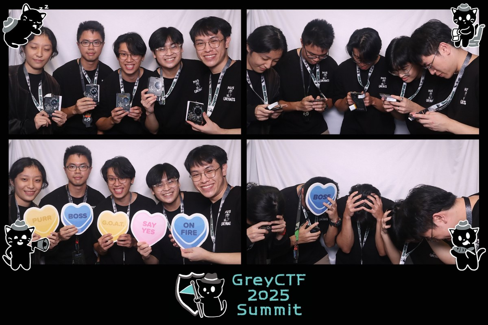
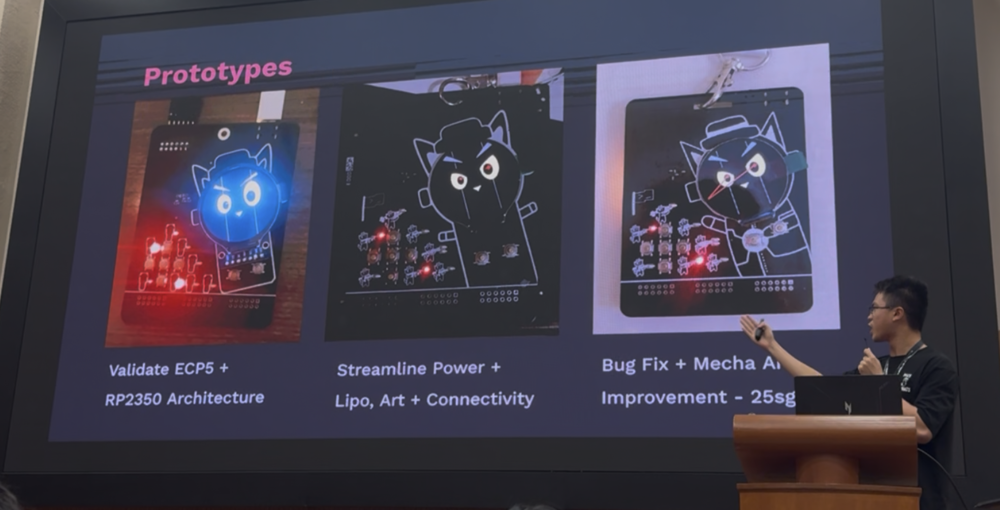
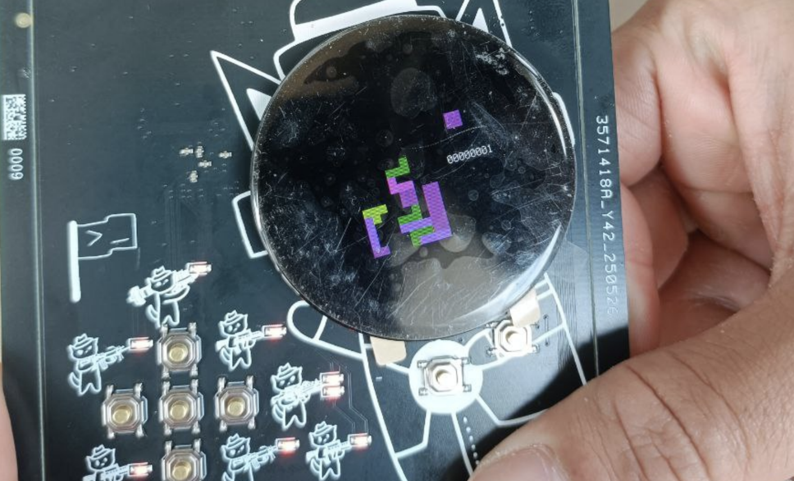
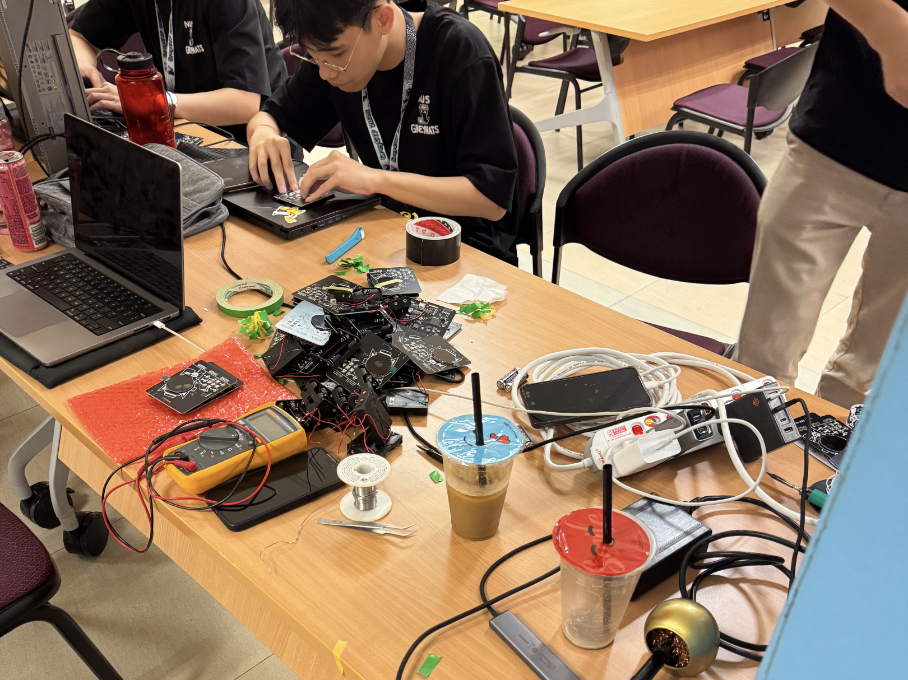
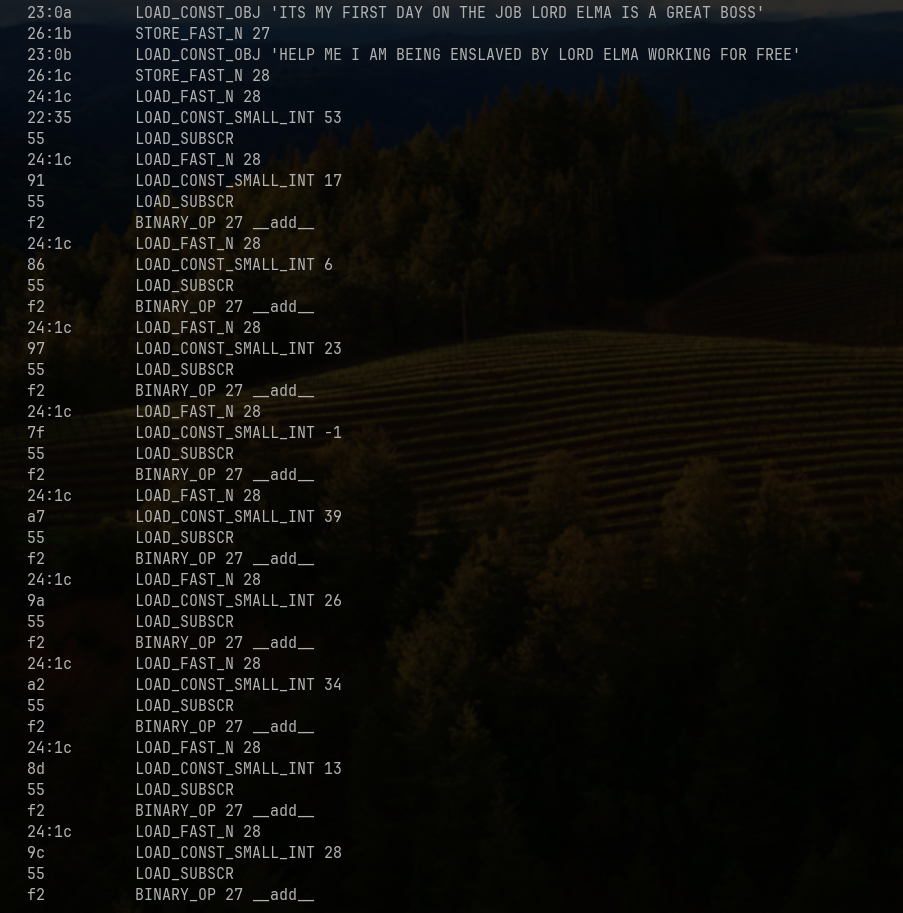
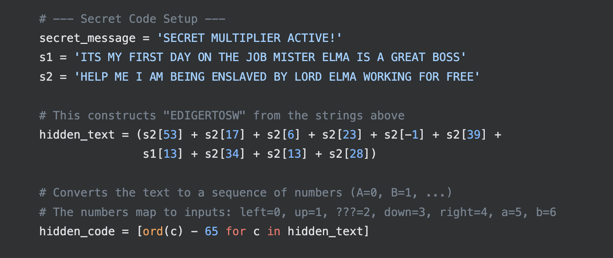
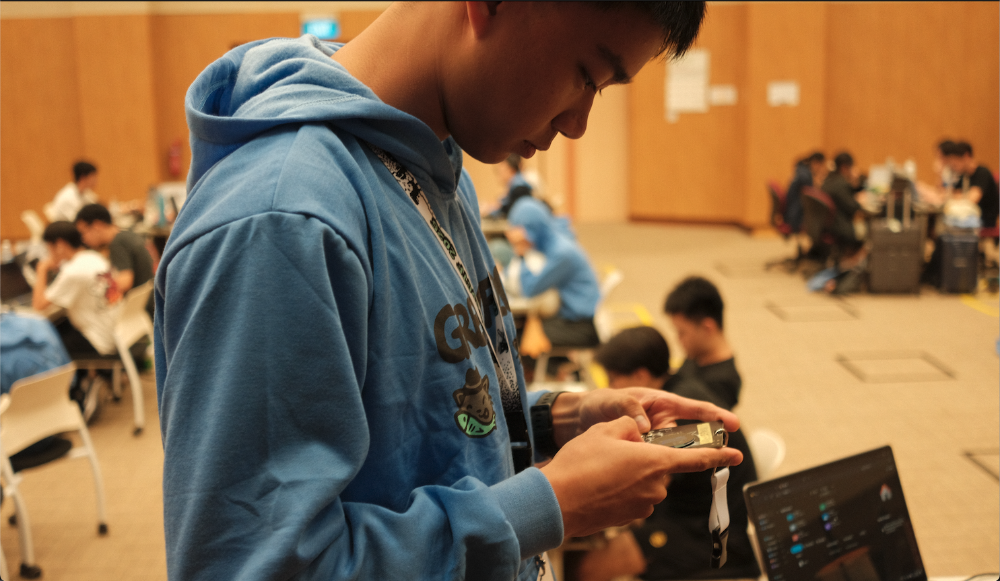
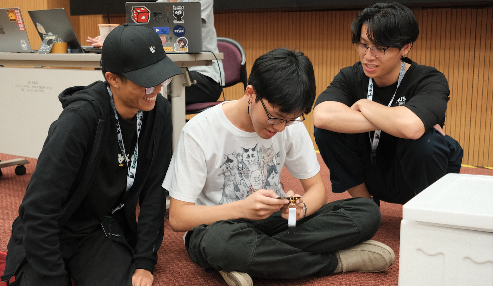

# GreyMecha2025 Tetris Author Write Up


> Since you are such a gooner on Tetris, wanna write it for the GreyCTF2025 badge? - Terence

For GreyCTF2025, [Terence](https://github.com/hackin7) approached me to write a CircuitPython compatible Tetris game for his upcoming GreyMecha/Army badge! As I have recently gotten addicted to Tetris, I agreed...

## The Badge

> hehe second version look like cat with nipples </br>

[Implementation by Terence](https://hackin7-blog.vercel.app/) 
Terence intentionally designed the badge around the idea of last year's Greycat, a Maimai badge and a Gameboy style badge! Being provided with the firmware and buttons, I just  had to implement it in CircuitPython!

## The Tetris implementation

The [base logic](https://github.com/deshipu/circuitpython-tetris-displayio/blob/master/tetris.py) of the Tetris game was taken from deshipu on github, where we had to make heavy modifications to get it to work! The main issues with this version was lack of proper debouncing, which allowed the player to move the pieces very fast by holding down keys, but that also made inputs inaccurate!


### Challenge Version
I had an idea for a [Konami Code](https://en.wikipedia.org/wiki/Konami_Code) style challenge, for that, we would need reliable input handling, which required consistent single click inputs to trigger. In order to support this challenge, we have to make some improvements!

Improvements:
- Port to make it compatible with our badge, running a RP2350 and FPGA, with a 150 x 150 screen, fortunately, it was displayio compatible.
- Debouncing and better input handling! So that the challenge can be triggered reliably.
- Last inputs tracking, to track the last 10 inputs for Konami Code!
- Description Box, to taunt playars and to print the flag.
- Score multiplier, triggered with Konami sequence as part of the challenge.
- Removed Z and S pieces, to make sure that the challenge was doable for non Tetris players.
	- I later regretted this decision as I severely underestimated that the average competitor played Tetris and found it harder without the Z and S pieces.
- Cosmetic color change to same as Tetris blocks with a grey background.

What I decided to leave out:
- Speed up, to make sure that the challenge was doable for non Tetris players. 
- Hold mechanism, as I was in a rush.
- T Spin, as I am not too sure how to implement it in a short time.

Creating the challenge version
- Challenge Version [source code](https://github.com/NUSGreyhats/greybadge25/tree/main/firmware/rp2350/src_chall/brick_game) 
- [Obfuscator](https://pyobfuscate.com/rename-obf)
```md
         ┌──────────┐                   ┌─────────┐    
clean ──▶│Obfuscator│──▶ obfuscated_ ──▶│mpy-cross│──▶ brick_game.mpy
version  └──────────┘     release       └─────────┘     
```

### Minigame version


2 hours into the sweatshop...
> Wouldn't it be cool if we had a more realistic Tetris on the badge as a Minigame? </br>We could have a leaderboard too! - Leyew

Massive Credits to [Leyew](https://github.com/itsme-zeix) for helping to implement new cool features too!

Even though we did not end up running it as a minigame, here are some quality of life improvements:
- Dynamic speedup to make it harder for experienced players. (None of us made it past Level 14)
- Concurrent music with audio speedup according to the dynamic speedup because Tetris just isn't the same without music.
- Z and S pieces because I completely underestimated the amount of people who played Tetris competitively at GreyCTF.
- Added Ghost Piece, to make the much more playable on a small screen!  
- Hold mechanic, so players dont have to always play no hold mode!


## The challenge! (and solution)
- Some goals I had for the challenge were:
	- Make the participants play Tetris because everyone should play Tetris.
	- Some simple cybersecurity related learning value e.g. Decompiling/Reversing
	- At least 3/4 participants solving it. (Ended up with 20/20!)
	- Come up to the stage style challenge.
	- For me to have fun writing it!
	- Not immediately LLM solvable because 
 	    > "Too much Claude makes you re\*\*\*ded"  - LJK

Extract the `apps/brick_game.mpy` file and use [mpy-tool.py](https://github.com/micropython/micropython/blob/master/tools/mpy-tool.py) to disassemble the bytecode

```bash
python3 mpy-tool.py -d brick_game.mpy
```
However, mpy-tool.py should not work because it was built for micropython and not circuitpython! In order to fix this, we can use a hex editor to change the header of our `brick_game.mpy` file, or just comment out these line in the tool.
```python
if header[0] != ord("M"):
	raise MPYReadError(filename, "not a valid .mpy file")
```
We should then get the CircuitPython bytecode! This is the snippet of the obfuscation used to hide the secret multiplier sequence:


Since we are not taking CS2100 here, and as there isnt a functioning decompiler for CircuitPython, our next best decompiler is ChatGPT/Gemini/Claude!

Shoutout to a [Janessa](https://github.com/12flamingoes) for spending 3 hours reversing the bytecode 🤯 and other participants with the intuition to try the Konami Code.

We can use this prompt in Gemini 2.5 Pro:
`using the following micropython bytecode, reconstruct the original python code in python`

2 Minutes and 42000 tokens later, we get a 90% accurate python code generated by LLMs, we can see the following logic! (The comments are wrong, I added a lot of garbage strings and fake flags hoping to throw LLMs off)


By reading the code, we can eventually realise that a hidden text `FGEAEADDBB` that when -65, corresponds to numbers corresponding to inputing the original Konami Code (UUDDLRLRBA) sequence. 

This would then  trigger a 1000x multiplier, making achieving 10000 points much easier! You can then test the POC on your device to get the placeholder flag `grey{go_do_this_on_stage}`. 

Come on stage to play the challenge to get the flag on my device!



## Possible future updates?
- Multiplayer to send lines to other players, similar to [tetr.io](https://tetr.io)
- Compilance to Super Rotation System (SRS), so that wallkicks and T spins can exist, and reliable spinning 

## Some References
- source code obfuscator https://pyobfuscate.com/
- CircuitPython online repl https://code.circuitpython.org/

## Some Cool Photos


