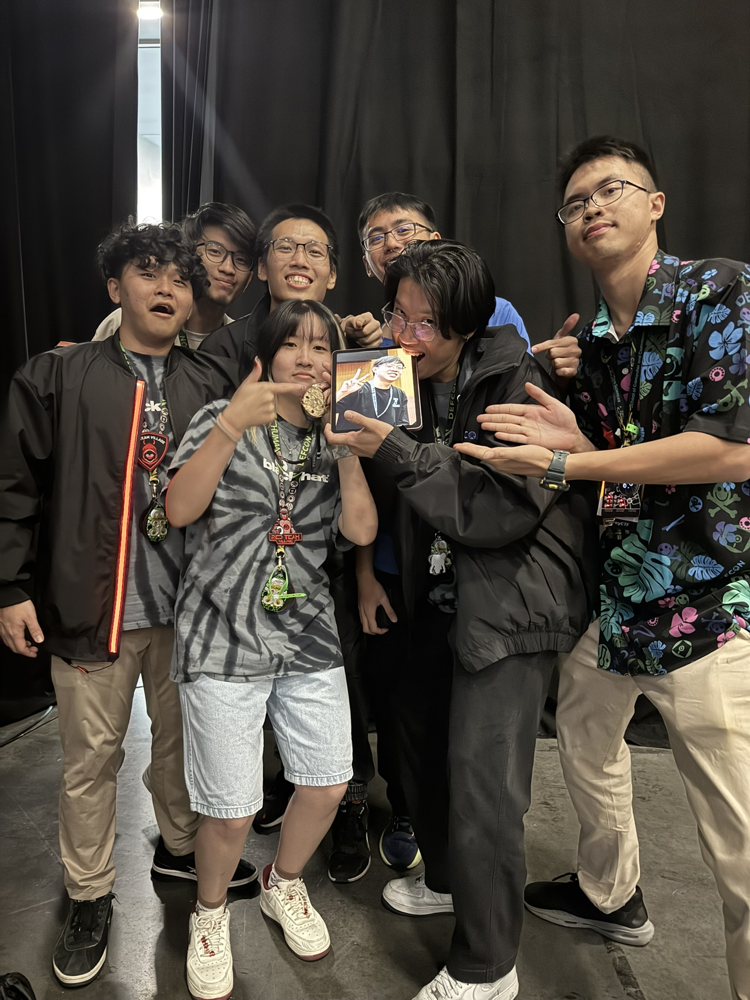
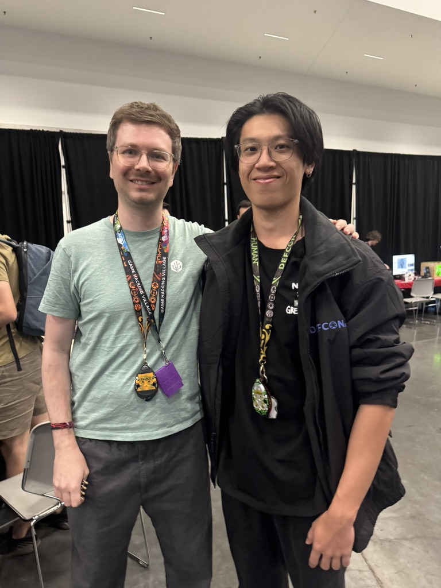
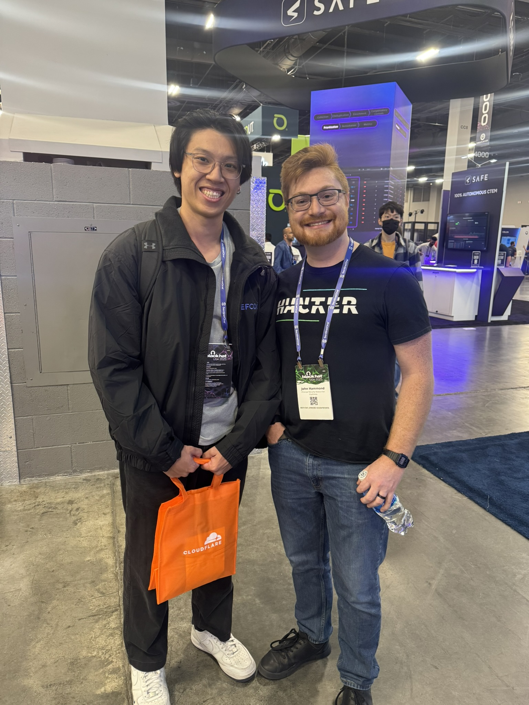
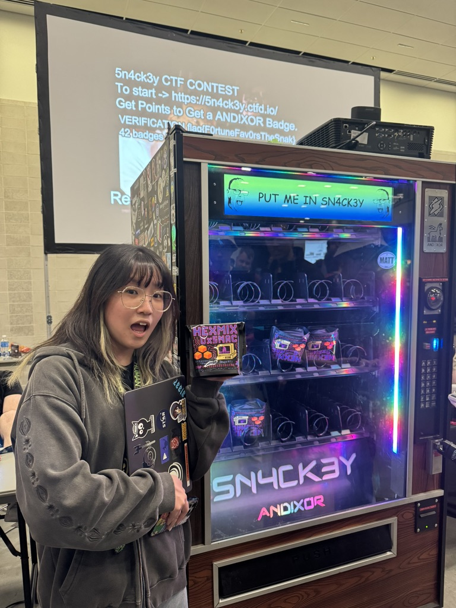
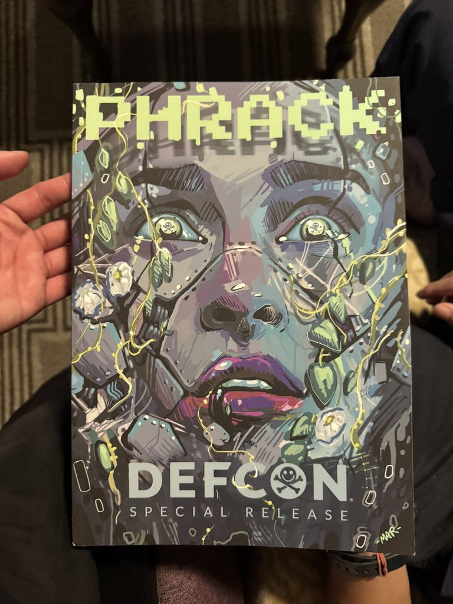

DEFCON33
===========================

> DEFCON has really strict rules about photo taking as many people in the industry are quite strict about their identity!

This August I got the chance to attend DEFCON 33 with [NUS Greyhats](https://nusgreyhats.org/team/)! This was an insanely cool experience for me as I have always wanted to attend DEFCON but didn't know I would get the opportunity so soon!

# The Villages

## Physical Security Village

Considering we were not allowed to own handcuffs in Singapore, this was a really cool experience getting to cuff myself and practice getting the cuffs off! There were a ton of setups of various types of locks, from physical doors to digital doors, and even a car door! Feels like knowledge you wouldn't need but could save you someday too!

## Red Team Village

## Malware Village

# The RTVCTF
Of the CTFs happening the one we decided to play was the Red Team Village CTF! This eventually led to us getting the Black Badge which was something they only decided on the last day of the event, and the first time ever RTVCTF got to give out one!

# Meeting My Idols!

Was one of the first few infosec youtubers I watched! Learned a ton of foundational knowledge from him. 

Similar to liveoverflow, really cool to meet john hammond in person, who was who got me into malware analysis in the first place! 

> I'm sad I didn't get to see LaurieWired :(

# Some fun activities

## Sn4ck3y

A CTF that lets you earn a cool hardware badge! unfortunately they ran out but I got a locktite which I needed too.

## Physical copies of Phrack everywhere!

Physical copy of phrack!!! Felt insanely cool have a physical copy of such a historical magazine, probably one of the coolest things I got from this DEFCON.

## Tinfoil hat CTF

> Create a tinfoil hat with 3 pieces of foil and compete in either Red(receive) or blue(block) team in blocking various signals from different locations onto a mannequin head!

## Getting a spoofed AppleTV connect request

Always fun to see people spray exploits! Apparently they try to connect and request passwords

## The Furries!

## Visiting Los Angeles

