Fixing Sandblaster on iOS 18.5
==============================
And also iOS 26.0 beta 4!

## Table of Contents
- Introduction
- Understanding the Sandbox
- Running Sandblaster
- Understanding the SBPL Binary
- Binary Diffing of macOS 14.4 and macOS 15.5
- Reversing `_collection_init()`
- Constructing the iOS 18 Header
- Modifying Sandblaster
- Conclusion
- Future Work & Lessons Learned
- References

## Introduction
Apple's Sandbox, formerly known as Seatbelt, is a kernel-level MACF policy that constraints Syscalls via per-process profiles written in the Sandbox Profile Language (SBPL), a TinyScheme-based Language, which can be understood similarly to iptables on typical linux systems. 
To put it simply, by reading the sandbox profile of a binary, we are able to understand the constraints the system has put onto it. Unfortunately, the sandbox profiles on iOS are compiled into a binary, before being interpreted by the Sandbox Kernel Extension (KEXT) and applied onto the application we want to execute.

Fortunately, researchers in the past have written papers and tools to help us decompile and understand them, papers like SandBlaster: Reversing the Apple Sandbox have helped create a foundational understanding of the Apple Sandbox, while tools like sandbox_toolkit, joker and sandblaster are able to help us dump and decompile the compiled profiles.
More recently, we have had a fork of [sandblaster by cellebrite labs](https://github.com/cellebrite-labs/sandblaster ) who have updated the tool to be compatible with up to iOS 17.7, unfortunately there were undocumented changes to the sandbox binary format on iOS 18.0 onwards, causing the tool to break. 

As of iOS 18.5, and with the recent iOS 26 beta 4 release (which also works with our modifications), it is in the interest of the iOS security community to have support for understanding sandbox profiles on iOS 18 and up.

## Understanding the Sandbox
With reference to existing research such as the [tfp0labs blog post](https://tfp0labs.com/blog/sandblaster-missing-readme) on sandblaster, the [CSW2019 presentation](https://census-labs.com/media/sandbox-argp-csw2019-public.pdf) by argp, the sandblaster paper(arXiv:1608.04303) and the [8ksec blog post](https://8ksec.io/reading-ios-sandbox-profiles/), we can develop a much better understanding of Apple's Sandbox:

Apple's Sandbox works as a mandatory access control (MACF) system at the kernel level. When an application starts, the kernel loads its corresponding sandbox profile which defines what resources the application can access. The sandbox is implemented as the `com.apple.security.sandbox` KEXT that intercepts system calls and checks them against the loaded profile.

The flow works as follows:
1. Application launches with its entitlements
2. Kernel loads the appropriate sandbox profile (platform.bin, application-specific or protobox.bin)
3. Each system call is intercepted by the MACF (Mandatory Access Control Framework)
4. The sandbox extension evaluates the call against the compiled profile rules
5. Access is either granted or denied based on the profile

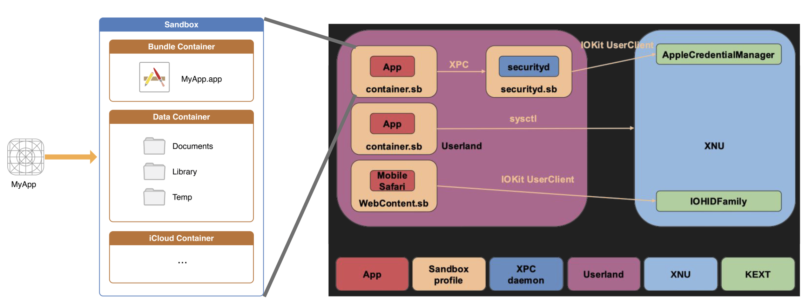

There are three main types of sandbox profiles:
- `Platform.sb` : Base profile that apply to all applications e.g. Platform.sb (unique to iOS)
- `Container.sb` : Profile that applies to all apps downloaded from the app store.
- `Application profiles` : Specific restrictions for individual apps. e.g. MobileMail.sb. Some of these can be found within the collections.bin which we will analyze later

## Running Sandblaster
To use Sandblaster, you'll need to extract the sandbox profiles from either iOS or macOS.
This is a similar guide to [tfp0labs blog](https://tfp0labs.com/blog/sandblaster-missing-readme) but using Ghidra:
### Extracting from iOS
```bash
# Download the IPSW for your target iOS version
ipsw download ipsw -d "iPhone15,2" -b "22F76" --kernel
# Extract the kernelcache
ipsw kernel extract 22F76__iPhone15,2/kernelcache.release.iPhone15,2 com.apple.security.sandbox
```
We now have a `com.apple.security.sandbox` binary!
We can open it in Ghidra or IDA, where we need to grab the:
1. operations.bin 
2. platform.bin
3. collections.bin
#### 1. Getting operations.bin
we can open the `com.apple.security.sandbox` kext in Ghidra and search for the "default" string.
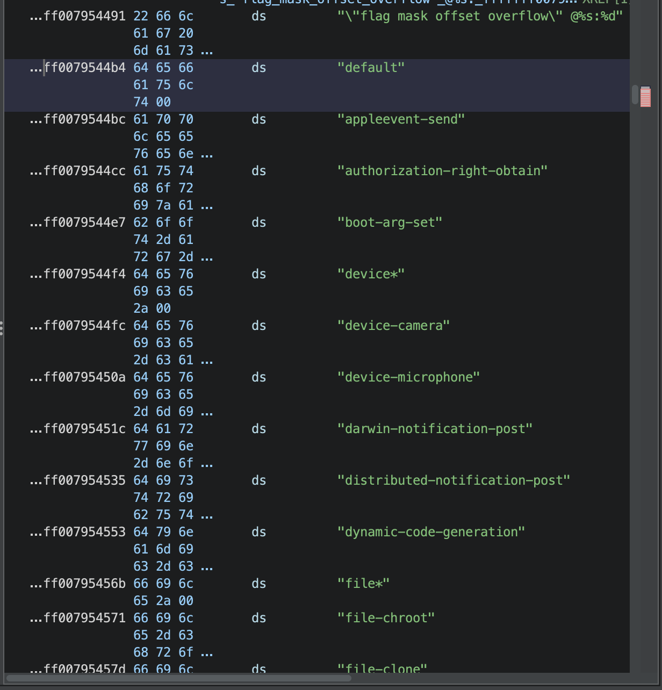
We will be pointed to a long string of operations starting from `default` ending with `xpc-message-send`, we can copy this entire chunk and select `extract and import`, then export the file from the Ghidra Project.
#### 2. Getting collections.bin
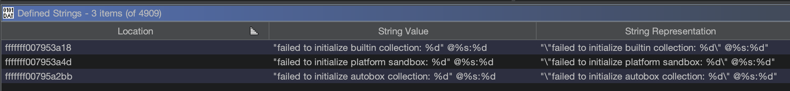
By searching for "failed to init" we can also find where the `collections` sandbox bundle and `platform` sandbox profile are being initialized.
Following the xref, we can find this lines of code:
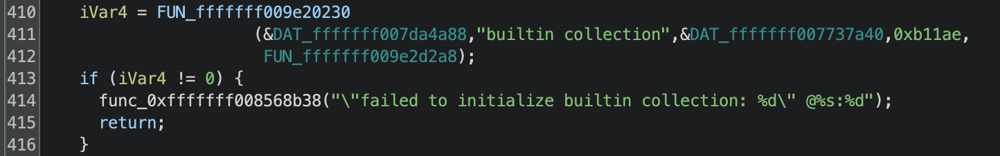
Here we know that `FUN_fffffff009e20230` is actually `_collection_init()` which we will analyze later. 
The builtin collection blob is at the `DAT_fffffff007737a40` address with size `0xb11ae`
With Ghidra, we can go to this address and right click -> data -> create array -> create an array sized `0xb11ae`, export this as `collection.bin`
#### 3. Getting platform.bin
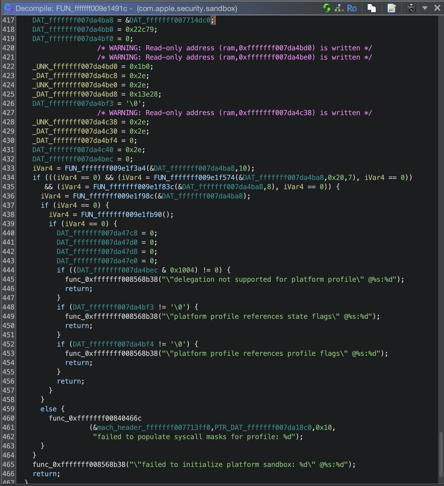
At the bottom of the function, we can see these lines of code, where:
`line 417` indicates the address of `platform.bin`
`line 418` indicates the `size` of the platform profile binary
- we can extract it in the same way as collections.bin

### Running Sandblaster 
```bash
git clone https://github.com/cellebrite-labs/sandblaster
cd sandblaster/reverse-sandbox
# optionally create a venv
python3 -m venv SB_ENV
source SB_ENV/bin/activate
# -r <version> -o <operations_list> -d <output_directory> <decompile_target> 
python3 reverse_sandbox.py -r 18 -o operations.txt -d output_dir platform.bin
```
## Understanding the SBPL Binary
The Sandbox Profile Language (SBPL) is compiled into a binary format for efficiency. According to the original Sandblaster paper, the binary structure consists of:
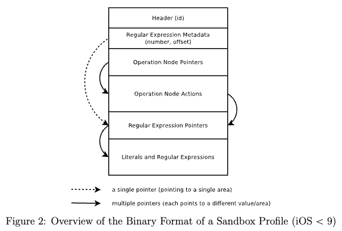
1. **Header**: Contains metadata about the profile (magic number, counts, etc.)
2. **Operation nodes**: Binary tree structure representing allow/deny rules
3. **Regular expressions**: Compiled regex patterns for path matching

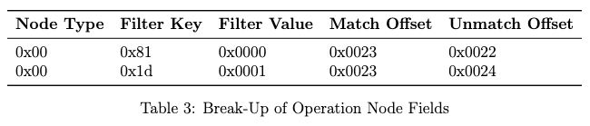
The binary format uses a compact representation where each operation is encoded as a node in a binary decision tree. Each node contains:
- Operation type (file-read, network-outbound, etc.)
- Decision (allow/deny)
- Filters and modifiers
- Links to child nodes

As for the bundles which are like our `collections.bin` binary of multiple sandbox profiles, the structure is as follows:
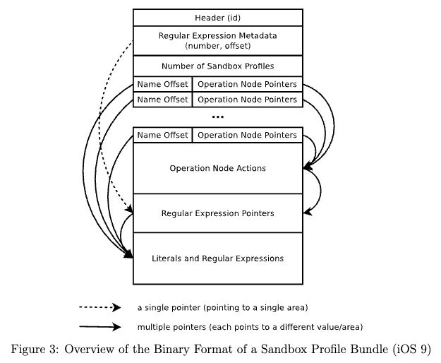
 
## Binary Diffing of macOS 14.4 and macOS 15.5
To understand what changed in iOS 18, we compared sandbox binaries from macOS 14.4 (corresponding to iOS 17.x) and macOS 15.5 (corresponding to iOS 18.x). This correlation exists because Apple shares the XNU kernel versions between iOS and macOS:

| macOS Version | iOS Version | XNU Kernel Major | Sandbox Ops Count |
| ------------- | ----------- | ---------------- | ----------------- |
| 14.4          | 17.7        | 10063            | 190 operations    |
| 15.5          | 18.5        | 11417            | 192 operations    |

We can get a detailed list of [version numbers from The Apple Wiki](https://theapplewiki.com/wiki/Kernel#iOS/iPadOS)

### setup sandbox_toolkit
create a simple `simple.sb` sandbox profile:
```
(version 2)
(allow file-read*
	(require-any
		(regex #"/bin/*")
		(vnode-type REGULAR-FILE)))
```
> As of now, I am unsure what `(version 2)` represents, it seems some of the profiles are shifting towards version 2 while some are left in version 1, perhaps we are in a transition period and version 2 is being tested. 

Use sandbox_toolkit to compile the profile (**note that we need to be on MacOS for this**):

Since this utilizes the MacOS SDK, which means it should be correctly using the the `compile()` function that is shipped with the developer tools:
```bash
git clone https://github.com/stefanesser/sandbox_toolkit
# Modify Makefile for arm64 if on Apple Silicon, we can change the 2nd line of
# sandbox_toolkit/compile_sb/Makefile to
GCC=$(GCC_BASE) -arch arm64 

make # make the compile_sb binary 

# compile <source_profile> <output_profile>
./compile_sb simple.sb simple.bin
```
### Diffing the binary
Using the sandbox_toolkit by Stefan Esser, we compiled identical SBPL profiles on both versions:
```bash
# On macOS 14.4 ARM64 VM
./compile_sb simple.sb simple_14.4.bin

# On macOS 15.5 ARM64 VM  
./compile_sb simple.sb simple_15.5.bin

# Compare the binaries
hexdump -C simple_14.4.bin > 14.4.hex
hexdump -C simple_15.5.bin > 15.5.hex
vimdiff 14.4.hex 15.5.hex
```
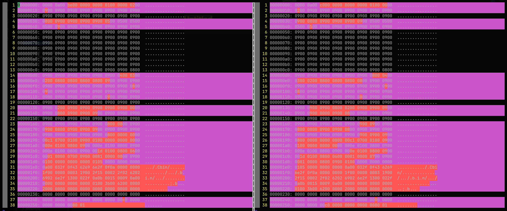
#### "Patching" the diff
A very crude way of comparing the binaries, and eventually seeing that there isn't much difference between our two `simple.sb`s can be achieved by adding in the missing bytes!
we can use something like 010 editor to make these changes:
```diff
# addresses are recalulated after each preeceding change
+add 00 00       at 0x0A 0x0B    (14.4 was missing 0000)
+add 00 00 00 00 at 0x16C D E F  (originaladdr 0x16A 0x16B) (14.4 was missing 0900 0900)
+add 00 00       at 0x193 0x194  (originaladdr 0x18D 0x18E) (14.4 was missing 0000)
```
resulting patch: 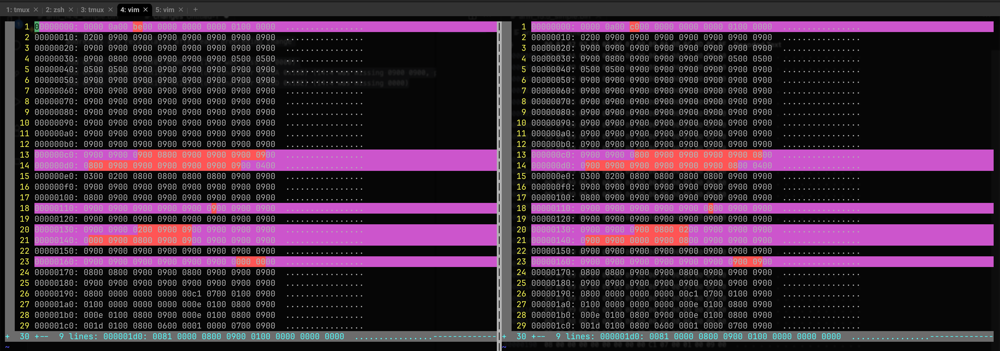
With this cleaned up version, we can see that the the header structure changed by 2 bytes, appearing after the states_count field. We also noticed the 5th byte changed from 0xBE (190) to 0xC0 (192), which we will see later when analyzing the `_collection_init()` function that it indicates the increased operation count.

## Analysis of dyld shared cache (DSC)
The [dyld shared cache](https://theapplewiki.com/wiki/Dev:Dyld_shared_cache) is a large file meant to improve performance, which previously could be altered, but now deprecated.
### grabbing the sandbox libraries 
- on our mac, we go to the path `/System/Volumes/Preboot/Cryptexes/OS/System/Library/dyld/dyld_shared_cache_x86_64h`
- on ARM64 macs, we can see that there are `BOTH ARM64 AND X86 DSCs`
- grab all the dyld_shared_cache files, and put into our working folder
- open it with IDA pro, select open individual modules, when doing so we see
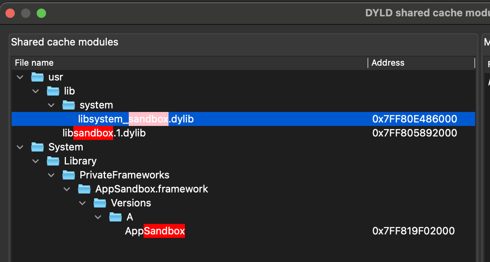
### libsystem_sandbox.dylib 
- looks like this is the library that provides the sandbox API, using dlop/dlsym to load `libsandbox.1.dylib`
- contains functions like `_sandbox_init`, `_sandbox_check` , `_sandbox_register` and unregister, `_sandbox_check`, `_sandbox_check_protected_app_container` which wrap the actual implementations of the sandbox.

```bash
ipsw extract --dyld <path_to_.ipsw> # get libsandbox.1.dylib 
```
My initial approach to this issue was to look at the `_compile()` function, to understand how the profile binary is generated, however, as we will soon see, its a gigantic function.

| Feature                                                                                                                                                                                                                                     | MacOS                                | iOS                                  |
| ------------------------------------------------------------------------------------------------------------------------------------------------------------------------------------------------------------------------------------------- | ------------------------------------ | ------------------------------------ |
| Compilation of sandbox profiles<br><br>"not supported on this platform" on iOS, while the macOS function calls compile()<br><br>we theorize that MacOS actually compiles the sandbox profiles as there are SBPL files stored on the system. | 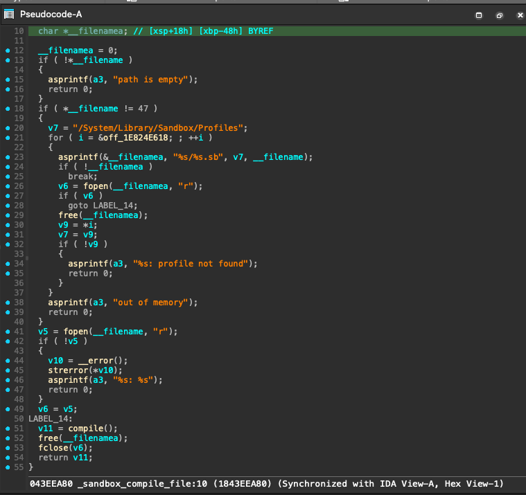 | 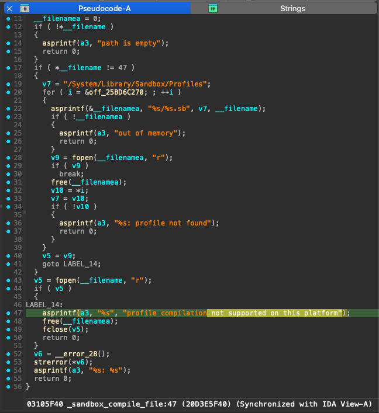 |
| `_compile` function                                                                                                                                                                                                                         | 1267 line long function<br>          | not present                          |

## `_compile` analysis
compared to the iOS DSC, the MacOS DSC contains a `_sandbox_compile_string()` which calls `_compile()`. By looking at the pseudocode, we can also see that on macOS, in place of line 47 rejecting a compilation, there is actually a call to `_compile()`.

We can also see that it is a gigantic function at 1267 lines, after some time of going through this function with little progress, I thought there might be a better way to approach this...

## Reversing `_collection_init()`
Instead of reversing the compilation process of the profile binary, why not we analyze where it is being interpreted? Using IDA, we can analyze the `_collection_init()` function which is responsible for parsing the bundled collection profiles in iOS.

Since the MacOS kernelcache is much better symbolicated, and we know that the `_compile()` function isn't available with iOS, we will start with using the MacOS kerenecaches.
### 1. Loading the kernelcache in IDA
As there seems to be a lack of documentation on the suffixes of kernelcaches (assume they are for different configurations of MacBooks?), I just picked one to work on as a quick comparison did not show much difference between the functions found inside.

|                                                 | Kernelcaches available                                      |                                             |
| ----------------------------------------------- | ----------------------------------------------------------- | ------------------------------------------- |
| MacOS 14.4                                      | MacOS 15.5                                                  | iOS 18.5                                    |
| .vma2<br>13g, 13j<br>14g, 14j <br>15g, 15j, 15s | .vma2<br>13g, 13j<br>14g, 14j <br>15g, 15j, 15s<br>16g, 16j | kernelcache.release<br>kernelcache.research |

### 2. Identifying the function
locate `_collection_init()` by:
-  searching for the "collection" string, seeing that it is called 
- Cross-referencing from `_hook_policy_init()`
- Noting that `_profile_init()` doesn't exist on iOS 18, only `_collection_init()`

### 3. (Optional) Symbolicating the kernelcache (iOS)
optionally we can use [the symbolicator tool ](https://blacktop.github.io/ipsw/blog/kernel-symbolication/#a-quick-demo-symbolicating-a-kernelcache-in-ida-pro) to help name some of the functions in the kernelcache, if we are using the MacOS kernelcache, we can skip this step.

obtain the newest kernelcache at this time:
```bash
ipsw download appledb --os iOS --version 18.5 -b '22F76' --device iPhone15,2 --kernel
```
check the amount of symbols on it
```bash
ipsw macho info --fileset-entry com.apple.kernel 22F76__iPhone15,2/kernelcache.release.iPhone15,2 | grep LC_SYMTAB
```
should have `Num Syms: 0`
clone the symbolicator
```bash
git clone https://github.com/blacktop/symbolicator.git
```
symbolicate (will print a ton of stuff to term)
```bash
ipsw kernel symbolicate --signatures 'symbolicator/kernel' --json 22F76__iPhone15,2/kernelcache.release.iPhone15,2
```
my symbolication stats were 
`Symbolication STATS     matched=21206 missed=4539 percent=82.3694% total=25745`
install the ida plugin
```bash
bash symbolicator/plugins/ida/install.sh
```
we can now open ida and use `Alt + f8` or `option + f8`, then select the new symbols json file to symbolicate our kernelcache (or just the sandbox kext)

### 4. Analyzing the header parsing
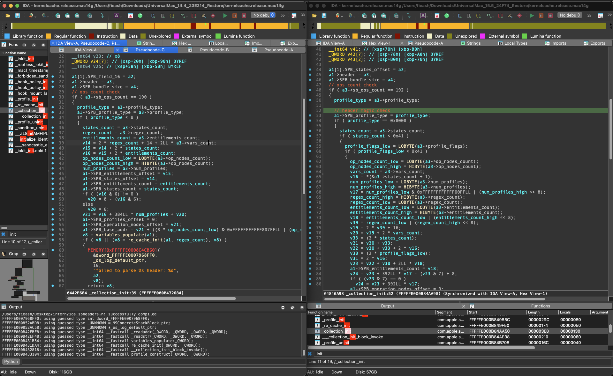
To make it easier to read, I have already imported the header struct into this binary, selecting the 3rd argument, `a3`  as the Sandbox Header.
The function begins by:
- Validating a magic number (0x8000 for bundled profiles)
- Parsing the header structure with specific byte offsets
- By tracing the parsing of the bytes, we can see that there seems to be an additional two bytes that are being checked for `0x41`.

### 5. Some theories
We found that iOS 18 kernelcache only has `_collection_init()` but not `_profile_init()`, suggesting iOS only allows bundled profiles, not custom ones.

## Constructing the iOS 18 Header
Through the analysis of the `_collection_init()` function, we reverse engineer the header and found that we should add two bytes right after the IGNORED byte. 
As for why I named it `profile_flags`, while looking for this difference, I came across a [fork of sandblaster ](https://github.com/gilboz/sandblaster/tree/feature/ios18_support)awhile ago naming it as such.

### iOS 16-17 Header Structure
```c
struct SBheader_iOS16 {
    uint16_t magic;           // 0x0000 or 0x8000
    uint16_t op_nodes_count;  // Number of operation nodes
    uint8_t  sb_ops_count;    // 190 operations
    uint8_t  vars_count;      
    uint8_t  states_count;    
    uint8_t  IGNORED;         // Padding byte?
    uint16_t num_profiles;    // Profile count
    uint16_t regex_count;     // Regex patterns
    uint16_t entitlements;    // Entitlement count
}; // Total: 14 bytes
```

### iOS 18+ Header Structure
```c
struct SBheader_iOS18 {
    uint16_t magic;           // 0x0000 or 0x8000
    uint16_t op_nodes_count;  // Number of operation nodes
    uint8_t  sb_ops_count;    // 192 operations (increased!)
    uint8_t  vars_count;      
    uint8_t  states_count;    
    uint8_t  IGNORED;         // Padding byte?
    uint16_t profile_flags;   // NEW
    uint16_t num_profiles;    // Profile count
    uint16_t regex_count;     // Regex patterns
    uint16_t entitlements;    // Seems unused in iOS 18 (always 0)
}; // Total: 16 bytes
```
we can import this into IDA to aid in our analysis!
- IDA Pro -> File -> Load File -> Parse Header file (^ + F9)

### Changes
- Addition of 2-byte `profile_flags` field after IGNORED byte
- Increase in operation count from 190 to 192


## Modifying Sandblaster
To support iOS 18+, we modified the Sandblaster tool with the following changes:

### 1. Adding Version Detection
We added a `-r` flag to specify the iOS version:
```python
if args.release.startswith("18"):
	print("Using iOS 18+ header")
	sandbox_data = parse_profile_ios18(infile)
else:
	print("Using iOS 16.5 header")
	sandbox_data = parse_profile(infile)
```

### 2. Implementing the New Header Structure
```python
def parse_profile_ios18(infile) -> SandboxData:
    infile.seek(0)
    # ios 18+
    header, \
    op_nodes_count, \
    sb_ops_count, \
    vars_count, \
    states_count, \
    profile_flags, \
    num_profiles, \
    re_count, \
    instructions_count \
        = struct.unpack('<HHBBBxHHHH', infile.read(16))

    sandbox_data = SandboxData.create_ios18(
        16, header, op_nodes_count, sb_ops_count, vars_count,
        states_count, profile_flags, num_profiles, re_count, instructions_count)

    sandbox_data.data_file = infile
    print(sandbox_data)
    
    return sandbox_data
```

### 3. Usage Examples
```bash
# For iOS 17.7 and below
python3 reverse_sandbox.py -r 16 -o operations.txt -d output platform.bin

# For iOS 18.0+ (including iOS 26 beta 4)
python3 reverse_sandbox.py -r 18 -o operations.txt -d output platform.bin
```

## Conclusion
We successfully updated Sandblaster to support iOS 18.5 and confirmed compatibility with iOS 26 beta 4 (23A5297i) by identifying and implementing the new binary header format. The key changes were:

1. **Header structure expansion**: iOS 18 added a 2-byte `profile_flags` field, increasing header size from 14 to 16 bytes
2. **Operation count increases**: From 190 (iOS 17) to 192 (iOS 18) to 195 (iOS 26 beta)
3. **Version-aware parsing**: Using the `-r` flag for compatibility across versions

The modified tool is available and can be used to analyze sandbox profiles on the latest iOS versions, helping security researchers understand the constraints placed on iOS applications.

## Future Work & Lessons Learned

### Future Work
- **Understanding profile_flags**: The exact purpose of this new 2-byte field remains unclear. 
- **Understanding Changes in Metadata**: Fortunately for us, the header was the only thing that caused the tool to crash, however, with binary diffing, we observed changes in the middle of the profile binaries as well, would be good to know what they are.
- **Filter/modifier documentation**: The new operations (190 -> 192) need proper analysis and documentation. [Diff by blacktop](https://x.com/blacktop__/status/1801139599386833014?s=46) 
  Operations are `mach-task-exception-port-set` and `sandbox-check`
- **Integration with SandScout**: Evaluating decompiled sandbox profiles for potential security weaknesses
- **Automated version detection**: Building automatic detection based on binary signatures rather than requiring manual version flags

### Lessons Learned
- Start with simple, known inputs (like `simple.sb`) to verify structural changes, sanity check often.
- Cross-reference multiple sources (kernelcache versions, DYLD cache, compiled binaries)
- Binary diffing between versions can sometimes be effective although painful on the eyes! 
- Understanding C++ virtual functions and Objective-C calling conventions helps a ton for kernel reversing!
- There are always a ton of unanswered questions, such as the new operations on each version, perhaps sometimes they are not worth looking into, we can make assumptions and note them down for now.

## References
- https://tfp0labs.com/blog/sandblaster-missing-readme
- [Sandblaster Paper 1608.04303v1](https://ar5iv.labs.arxiv.org/html/1608.04303)
- Apple Sandbox Guide by fG!
- [Vs com.apple.security.sandbox by argp](https://census-labs.com/media/sandbox-argp-csw2019-public.pdf)
- [Hack In The Sand Box by Jonathan Levin ](https://newosxbook.com/files/HITSB.pdf)
- https://8ksec.io/reading-ios-sandbox-profiles/
- https://github.com/GhidraEnjoyr/iOS-Reverse-Engineering
- https://theapplewiki.com/wiki/Kernel#iOS/iPadOS
- https://www.nowsecure.com/blog/2024/09/11/reversing-ios-system-libraries-using-radare2-a-deep-dive-into-dyld-cache-part-1/
- https://opensource.apple.com/releases/
- https://googleprojectzero.blogspot.com/2025/05/breaking-sound-barrier-part-i-fuzzing.html
- iOS hacker's handbook
